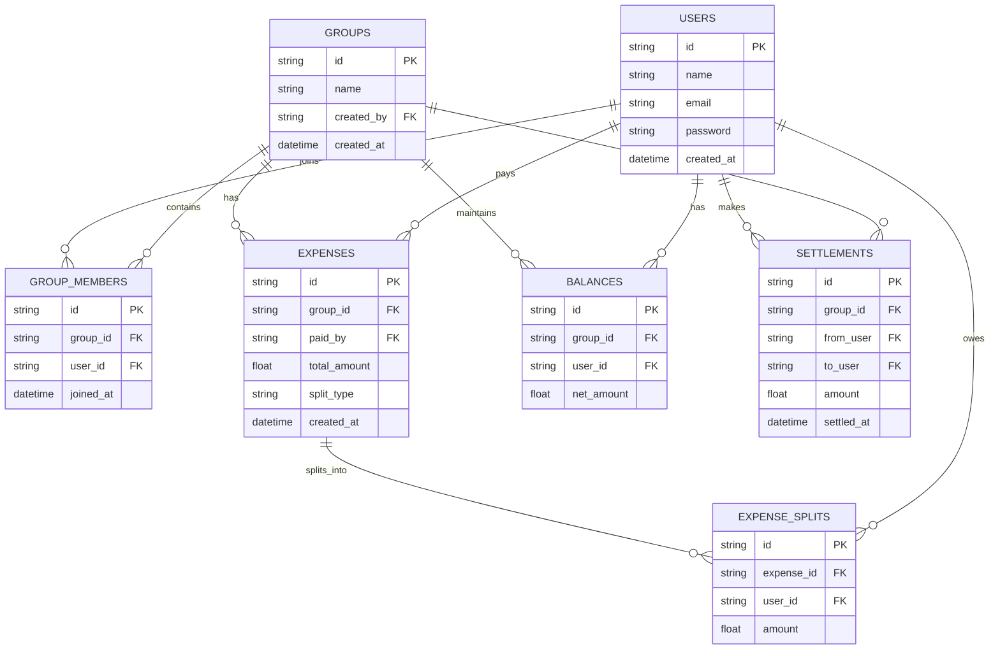

# ER Diagram – Smart Expense Sharing System

This document represents the database schema and relationships between tables.

---

# Entities Overview

1. Users
2. Groups
3. GroupMembers
4. Expenses
5. ExpenseSplits
6. Balances
7. Settlements

---

# Mermaid ER Diagram

