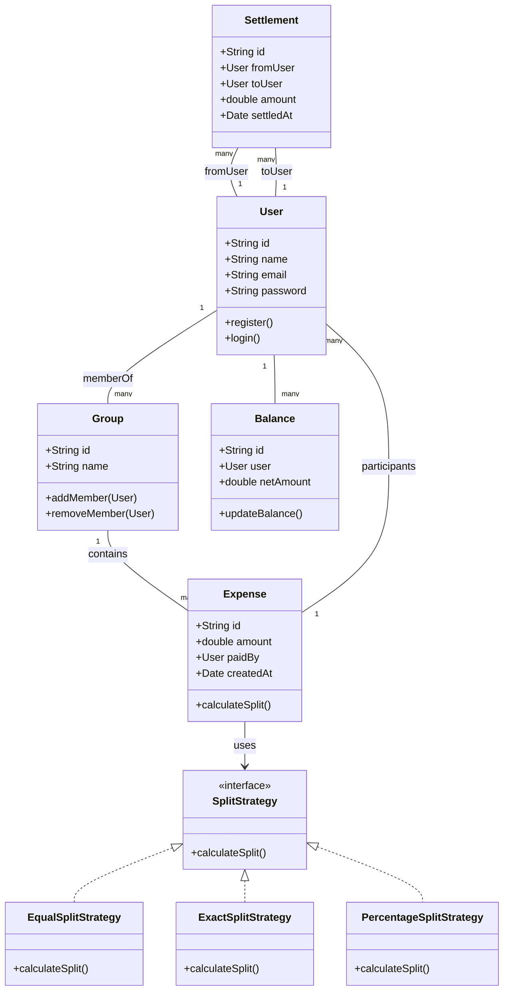

# Class Diagram – Smart Expense Sharing System

This document represents the core domain model and class relationships of the system.

---

# Mermaid Class Diagram

```mermaid
classDiagram

%% ========================
%% Core Entities
%% ========================

class User {
    +String id
    +String name
    +String email
    +String password
    +register()
    +login()
}

class Group {
    +String id
    +String name
    +addMember(User)
    +removeMember(User)
}

class Expense {
    +String id
    +double amount
    +User paidBy
    +Date createdAt
    +calculateSplit()
}

class Balance {
    +String id
    +User user
    +double netAmount
    +updateBalance()
}

class Settlement {
    +String id
    +User fromUser
    +User toUser
    +double amount
    +Date settledAt
}

%% ========================
%% Strategy Pattern
%% ========================

class SplitStrategy {
    <<interface>>
    +calculateSplit()
}

class EqualSplitStrategy {
    +calculateSplit()
}

class ExactSplitStrategy {
    +calculateSplit()
}

class PercentageSplitStrategy {
    +calculateSplit()
}

%% ========================
%% Relationships
%% ========================

User "1" -- "many" Group : memberOf
Group "1" -- "many" Expense : contains
Expense "1" -- "many" User : participants
User "1" -- "many" Balance
Settlement "many" -- "1" User : fromUser
Settlement "many" -- "1" User : toUser

SplitStrategy <|.. EqualSplitStrategy
SplitStrategy <|.. ExactSplitStrategy
SplitStrategy <|.. PercentageSplitStrategy

Expense --> SplitStrategy : uses
```