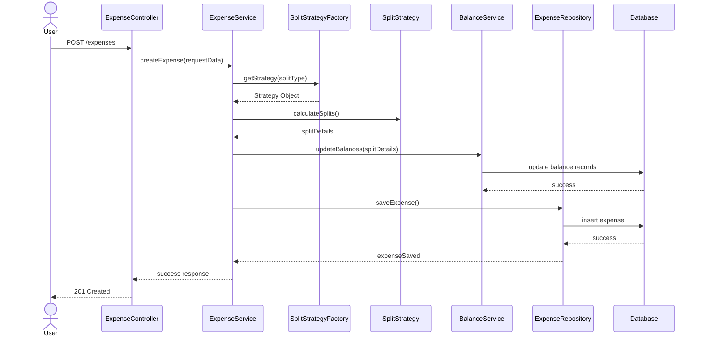
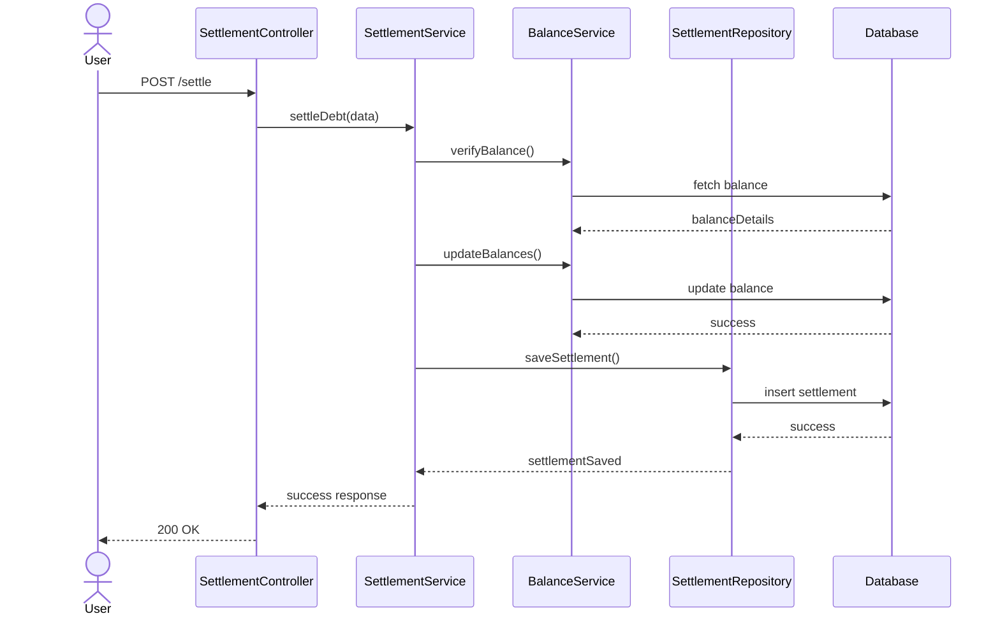

# Sequence Diagram – Smart Expense Sharing System

This document represents the main backend flow of the system.

---

# 1️⃣ Add Expense Flow

## Scenario:
User adds a new expense inside a group.

## Steps:

1. User sends request to add expense.
2. Controller validates request.
3. Service selects appropriate Split Strategy.
4. Split amounts are calculated.
5. Balances are updated.
6. Expense is stored in database.
7. Updated balances are returned.

---

---

# 2️⃣ Settle Debt Flow

## Scenario:
User settles debt with another user.

## Steps:

1. User initiates settlement.
2. Controller validates request.
3. Service verifies outstanding balance.
4. Balance is updated.
5. Settlement record is stored.
6. Confirmation returned.

---

## Mermaid Sequence Diagram

---

# Key Design Highlights

- Clear separation of layers (Controller → Service → Repository)
- Strategy Pattern used for split logic
- Balance consistency maintained through service layer
- Database interactions abstracted via repository