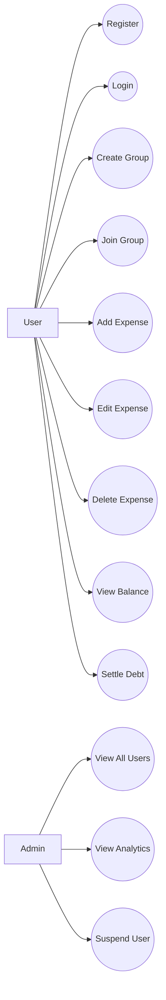

## 1. Actors

1. User
2. Admin (optional, system-level role)

---

## 2. User Use Cases

### Authentication
- Register
- Login
- Logout

### Group Management
- Create Group
- Join Group (via invite link)
- Add Member to Group
- Remove Member from Group
- View Group Details

### Expense Management
- Add Expense
- Edit Expense
- Delete Expense
- Choose Split Type:
    - Equal Split
    - Exact Split
    - Percentage Split

### Balance & Settlement
- View Balances
- View Who Owes Whom
- Settle Debt
- View Settlement History

---

## 3. Admin Use Cases (Optional)

- View All Users
- View System Analytics
- Suspend User

---

